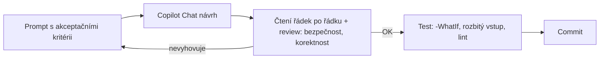

# VS Code, Git a Copilot Chat workflow

> Typ: povinný · Den: 1 · Odhad: 45 min výklad + 45 min lab

## Cíle
- Ovládat VS Code jako pracovní prostředí pro automatizační skripty (workspace, `tasks.json`, formátování, ladění).
- Dodržovat základní hygienu repozitáře — malé commity s popisnou zprávou, pull před
  push, review před mergem — a umět doporučit, kde má repozitář organizace bydlet
  (GitHub vs Azure DevOps vs self-hosted, viz [`explainer-git-hosting.md`](explainer-git-hosting.md)).
- Používat **M365 Copilot Chat (free)** zodpovědně jako asistenta pro přípravu a testování skriptů — s explicitním promptingem, bezpečnostními mantinely a akceptačními kritérii, ne slepým přijímáním návrhů.
- Rozumět třem runtime prostředím automatizace (DEV stanice, kontejner/CI, server) — viz
  [`explainer-runtime-environments.md`](explainer-runtime-environments.md).

## Výklad

### VS Code pro automatizaci
`.vscode/tasks.json` (verze `2.0.0`) definuje opakovatelné akce — build/test/lint — jako `type: "shell"` nebo `"process"` úlohy s `label`, `command`, `args` a `group` (`build`/`test`, případně `isDefault`). Umístění v `.vscode/` znamená, že konfigurace jde do repozitáře a sdílí se s týmem, ne jen s jedním strojem — a je to JSON, který od rána umíte číst ([`../formats-fundamentals/`](../formats-fundamentals/)). `launch.json` řeší ladění. Formátování při uložení + linting (PSScriptAnalyzer pro PowerShell) patří do tasků, ne jen do nastavení editoru — jinak selžou v CI, kde editor neběží.

### PowerShell extension — náhrada za ISE
VS Code s **PowerShell extension** je Microsoftem doporučené prostředí pro vývoj PowerShell
skriptů — a jediné podporované pro PowerShell 7. **Windows PowerShell ISE** stále existuje,
ale není aktivně vyvíjené a **umí jen Windows PowerShell 5.1** — pro tento kurz (PS7-first,
viz [`../../day-2/powershell-deep-dive/explainer-module-management.md`](../../day-2/powershell-deep-dive/explainer-module-management.md))
je tedy mimo hru. Extension dává vše, co ISE, a navíc: IntelliSense nad cmdlety, integrovaný
debugger (breakpointy, `launch.json`), PSScriptAnalyzer linting přímo v editoru, spouštění
výběru F8 a integrovanou PowerShell konzoli. Pro adminy zvyklé na ISE existuje **ISE Mode**
(Command Palette → "PowerShell: Enable ISE Mode").

### Git základy a hygiena repozitáře
Skripty jsou kód a kód patří do Gitu — bez ohledu na to, kde repozitář bydlí. Malé
commity s popisnou zprávou (proč, ne jen co), **pull před push**, review před merge do
`main`, checklist zaměřený na automatizační kód: hardcoded identifikátory (tenant ID,
ClientId, secrety), chybějící error handling, chybějící `-WhatIf` u destruktivních
skriptů. Pro tento kurz stačí lineární práce v `main` s malými commity — branch/PR
disciplína je cílový stav pro tým, ne vstupní požadavek. Slovníček (commit, push/pull,
branch, pull request, merge, `.gitignore`), srovnání hostingů **GitHub vs Azure DevOps
vs self-hosted** a doporučení pro organizace veřejné správy:
[`explainer-git-hosting.md`](explainer-git-hosting.md).

### M365 Copilot Chat (free) zodpovědně
Kurz používá **M365 Copilot Chat ve free verzi** — je součástí přihlášení firemním účtem
(`m365.cloud.microsoft/chat`), nic se nedokupuje a běží s **enterprise data protection**:
prompty a odpovědi zůstávají chráněné v rámci M365 služby, netrénují modely. To je
klíčový argument — AI asistent, který licenčně i datově „přijde s tím,
co už máte".

Pravidla práce (stejná jako u kteréhokoli AI asistenta):
- **Priming prompt na začátek každé konverzace** — free verze nemá trvalé custom
  instructions; pravidla proti fantazii (jen existující cmdlety, přiznaná nejistota,
  placeholdery místo identifikátorů) se vkládají jako první zpráva — závazný text
  v [`../formats-fundamentals/copilot-priming-prompt.md`](../formats-fundamentals/copilot-priming-prompt.md).
- **Akceptační kritéria do promptu** — co má skript dělat, co nesmí (mazat/měnit), jaké
  má mít parametry a chování při chybě. Vágní prompt = vágní skript.
- **Návrh není hotový kód** — každý vygenerovaný skript se čte řádek po řádku a testuje
  (`-WhatIf`, rozbitý vstup) před ostrým spuštěním; odpovědnost nese člověk.
- **Nic citlivého do promptu** — tenant ID, ClientId, secrety, thumbprinty tam nepatří
  (pravidlo z [`../onboarding/ways-of-working.md`](../onboarding/ways-of-working.md)).
- **Chat jako učebnice** — „vysvětli řádek 3", „proč try/catch a ne -ErrorAction" jsou
  legitimní a žádoucí dotazy; free verze nemá integraci do editoru, workflow je
  chat v prohlížeči ↔ VS Code přes schránku.

**GitHub Copilot** (placený, integrovaný přímo ve VS Code) je zmíněn jako navazující krok
pro firmu, až workflow přijme za svůj — pro kurz není potřeba.

## Klíčové rozlišení
- **VS Code + PowerShell extension vs Windows PowerShell ISE** — ISE není aktivně vyvíjené a
  umí jen Windows PowerShell 5.1; pro PS7 je VS Code s extension jediné podporované
  prostředí. ISE Mode usnadní přechod, cíl je plný VS Code workflow.
- **M365 Copilot Chat (free) vs GitHub Copilot (placený)** — chat v prohlížeči s enterprise
  data protection zdarma k firemnímu účtu vs placená integrace přímo v editoru; workflow
  (kritéria → review → test) je u obou stejný. Pozor: v D4–5 znamená „Copilot" zase jiné
  produkty (M365 Copilot licence) — viz [`../../GLOSSARY.md`](../../GLOSSARY.md).
- **Copilot návrh vs přijatý/otestovaný kód** — návrh je vstup k review, ne hotový výstup.
- **Formátování vs linting** — formátování řeší styl, linting hledá reálné chyby
  (PSScriptAnalyzer); obojí patří do `tasks.json`, aby fungovalo i mimo editor.

## Lab
Viz [`lab-repo-scaffold.md`](lab-repo-scaffold.md).

## Tipy
- Neakceptujte první návrh bez přečtení — review si řekněte nahlas, než dáte
  `git commit`; i vygenerovaný kód mívá nálezy z lintu.
- Kopírování chat ↔ editor berte jako výhodu: nutí kód při přenosu skutečně přečíst.
- Zvyklí na ISE? „PowerShell: Enable ISE Mode" je můstek — ale ISE neumí PowerShell 7,
  kterým kurz jede, takže cíl je plný VS Code workflow.

## Zdroje (Microsoft)
- [Integrate with External Tools via Tasks (VS Code)](https://code.visualstudio.com/docs/debugtest/tasks)
- [Using Visual Studio Code for PowerShell Development](https://learn.microsoft.com/en-us/powershell/scripting/dev-cross-plat/vscode/using-vscode)
- [How to replicate the ISE experience in Visual Studio Code](https://learn.microsoft.com/en-us/powershell/scripting/dev-cross-plat/vscode/how-to-replicate-the-ise-experience-in-vscode)
- [Microsoft 365 Copilot Chat overview](https://learn.microsoft.com/en-us/copilot/overview)

## Stav produktu / delta
> [!WARNING]
> Ověřit k datu běhu — hranice free vs placeného M365 Copilot Chat (funkce, limity,
> vstupní URL, dostupnost agentů) se mění rychle; ověřit na kurzovním tenantu den před
> během. GitHub Copilot Free tier existuje (limitovaný počet chat požadavků/měsíc) —
> pro kurz nespoléhat, zmínit jen jako ochutnávku editor integrace.
