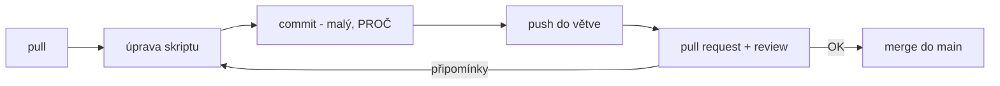

# Explainer · Git, GitHub, Azure DevOps — a kam s repozitářem ve veřejné správě

Deep-dive k [`README.md`](README.md). Skripty z tohoto kurzu jsou kód — a kód patří
do verzovacího systému. Tento explainer odpovídá na tři otázky: co je Git, kde má
repozitář bydlet (pro organizace typu státní správa a samospráva) a jak s ním
hygienicky pracovat.

## Git ≠ hosting — dvě různá rozhodnutí

**Git** je nástroj na vašem disku: eviduje verze souborů, kdo–kdy–co–proč změnil,
a umí se vrátit k libovolnému stavu. Funguje i úplně offline, bez jakékoli služby.
**GitHub / Azure DevOps / GitLab** jsou hostingy: místo, kde repozitář bydlí, kde se
tým potkává nad review a odkud se automatizuje (pipelines). Git je rozhodnutí, které
neřešíte — **verzovat budete v každém případě**. Hosting je volba podle organizace.

## Kam s repozitářem — volba pro veřejnou správu

| Služba | Silné stránky | K zvážení |
|---|---|---|
| **Azure DevOps** | přihlášení **Entra ID** (tytéž účty, MFA a offboarding jako M365), volba EU regionu při založení organizace, Repos + Boards + Pipelines v jednom, zdarma do 5 uživatelů | UI méně „moderní" než GitHub; menší komunitní ekosystém |
| **GitHub** | největší ekosystém a dokumentace, nejtěsnější integrace GitHub Copilotu, Actions | Entra SSO a EU data residency až v Enterprise tieru; ve free/team tieru účty žijí mimo vaši identitu |
| **GitLab / Gitea (self-hosted)** | plná datová suverenita — repo ve vlastní infrastruktuře | provozujete a zabezpečujete sami (patche, zálohy, dostupnost) — reálné náklady |

**Doporučení pro státní správu a samosprávu:** výchozí volba je **Azure DevOps**.
Rozhoduje identita — repozitář se skripty, které sahají na váš tenant, má být chráněný
stejnými účty, MFA a Conditional Access jako tenant sám; odchod zaměstnance pak
automaticky znamená konec přístupu i ke kódu. K tomu EU region, nulová vstupní cena
a Boards na evidenci požadavků. GitHub je dobrá alternativa, pokud tým chce jeho
ekosystém (a je ochotný platit Enterprise za Entra SSO); self-hosted GitLab volte jen
při tvrdém interním požadavku „vše ve vlastní serverovně" — bezpečnostní legislativa
(ZoKB/NIS2) cloud nezakazuje, vyžaduje řízení rizik, a organizace provozující M365 už
Microsoft cloudu data svěřila. V každém případě: repo se skripty k tenantu je **vždy
neveřejné** a nikdy neobsahuje identifikátory a tajemství
(viz [`../onboarding/ways-of-working.md`](../onboarding/ways-of-working.md)).

## Hygiena práce s Gitem — slovníček a denní rytmus

- **commit** — uložený „snímek" změny. Malý (jedna logická změna) a se zprávou, která
  říká **proč**, ne jen co: `Oprava stránkování - bez nextLink vracel jen 1. stránku`
  je zpráva; `update` není.
- **push / pull** — odeslání commitů na hosting / stažení cizích commitů k sobě.
  Návyk: **pull před push** — nejdřív si vezmu změny ostatních, pak posílám svoje.
- **branch (větev)** — oddělená linie práce; `main` je vždy funkční stav, experimenty
  a úpravy žijí ve větvi (`feature/inventura-webu`).
- **pull request (PR)** — žádost „přijměte mou větev do main" spojená s **review**:
  druhý člověk čte změnu dřív, než se stane součástí main. U skriptů s přístupem
  k tenantu je PR review totéž co čtyři oči na produkční změně.
- **merge** — spojení větve zpět; když dva změnili totéž místo, vznikne **konflikt**
  a Git chce rozhodnutí člověka (VS Code ho zobrazí přehledně — není se čeho bát).
- **.gitignore** — seznam toho, co do repa nikdy nevstoupí: `*.pfx`, `*credentials*`,
  exporty s reálnými daty. Tajemství, které se do gitu jednou dostalo, zůstává
  v historii — proto se tam nesmí dostat vůbec.

Pro tento kurz stačí lineární práce v `main` s malými commity (viz
[`README.md`](README.md)) — branch/PR rytmus výše je cílový stav pro tým, ne vstupní
požadavek. Až budete zavádět doma: začněte pravidlem „main je vždy funkční + PR na
všechno" a zbytek dorůstá sám.

## Zdroje

- [Pro Git — kniha zdarma, česky](https://git-scm.com/book/cs/v2)
- [Azure DevOps Repos — dokumentace](https://learn.microsoft.com/en-us/azure/devops/repos/)
- [Azure DevOps — data residency / volba regionu](https://learn.microsoft.com/en-us/azure/devops/organizations/security/data-location)
- [GitHub Skills — interaktivní kurzy](https://skills.github.com/)

## Stav produktu / delta
> [!WARNING]
> Ověřit k datu běhu — tiery a ceny (Azure DevOps free tier, GitHub Enterprise s Entra
> SSO/EMU, data residency) se mění; před doporučením konkrétní organizaci zkontrolovat
> aktuální ceníky a dostupnost EU residency.
