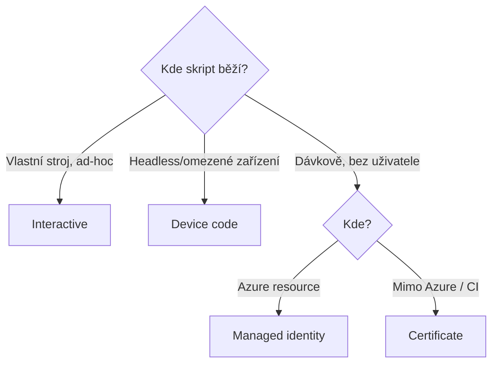

# PowerShell do hloubky

> Typ: povinný · Den: 2 · Odhad: 45 min výklad + 90 min Lab 3

## Cíle
- Moduly: PnP.PowerShell, Microsoft.Graph, SPO Management Shell — rozdíly a použití.
- Autentizace: interaktivní, device code, certifikát, managed identity.
- Správa modulů v čase: scopes, version pinning, PSResourceGet — viz
  [`explainer-module-management.md`](explainer-module-management.md).

## Výklad

### Tři PowerShell moduly
**PnP.PowerShell** je community-driven modul s nejširším pokrytím SharePoint Online (weby,
listy, provisioning šablony, branding) — stovky cmdletů, běží kdekoli (Windows/Mac/Linux/Azure
Function/Runbook). **Microsoft.Graph** je oficiální PowerShell SDK generovaný přímo ze schématu
Microsoft Graph API — pokrývá identity, skupiny, Teams a cokoli napříč M365, co SPO moduly
neřeší. Modul je rozdělen na desítky submodulů (`Microsoft.Graph.Users`, `Microsoft.Graph.Sites`
atd.), takže lze instalovat jen potřebnou část. **SPO Management Shell**
(`Microsoft.Online.SharePoint.PowerShell`) je oficiální tenant-admin modul pro nastavení
mimo rozsah PnP — typicky `Set-SPOTenant` a nejnovější preview nastavení, která často
přistanou v SPO modulu dřív než v PnP ekvivalentu.

### Autentizační módy
- **Interaktivní** — `-Interactive` (PnP) otevře webový dialog / WAM prompt s MFA flow; vhodné
  pro ad-hoc práci na vlastním stroji.
- **Device code** — dvoukrokový flow pro headless/omezená zařízení: aplikace vygeneruje kód,
  uživatel ho zadá na jiném zařízení přes browser a projde běžnou autentizací včetně MFA;
  nevyžaduje client secret. Dostupné jen pro **public client** aplikace — tj. aplikace
  běžící na zařízení uživatele (konzole, desktop), které neumí udržet tajemství, a proto
  se prokazuje jen uživatel, ne aplikace. Technický detail, který ušetří hodinu ladění:
  device code **nemá redirect URI**, takže Entra nemůže typ klienta odvodit z platformy
  a sáhne po fallbacku — přepínači *Authentication → Allow public client flows*
  (`isFallbackPublicClient`; nastavoval ho Lab 2). Vypnutý fallback = `AADSTS7000218`.
  Interaktivního přihlášení se přepínač **netýká** — tam Entra typ pozná z redirect URI
  `http://localhost` na platformě *Mobile and desktop applications*, proto `-Interactive`
  funguje i s vypnutým přepínačem. Protipól je **confidential client** — aplikace mimo
  dosah uživatele (server, Function), která se prokazuje vlastním credentialem: přesně
  to dělá certifikátový app-only režim níže. Jedna app registrace může podporovat obojí.
- **Certifikát** — asymetrický klíč nahraný jako app credential místo sdíleného secretu;
  Microsoft doporučuje certifikáty jako bezpečnější variantu pro app-only scénáře (dávkové
  operace, žádný přihlášený uživatel).
- **Managed identity** — identita vázaná přímo na Azure resource (Function App, Automation
  Account); systémově přiřazená (1:1 s resourcem, zanikne s ním) nebo uživatelsky přiřazená
  (nezávislý životní cyklus, lze přiřadit více resourcům). Žádný spravovaný secret/cert.



### Ověření stavu připojení — první příkazy po každém Connect
Návyk od prvního připojení: **connection objekt → token → reálné volání.** Připojení
není důkaz oprávnění (authn ≠ authz) — důkaz je až token a odpověď serveru.

```powershell
# 1. Kam a jak jsem připojený (stav v paměti PowerShellu)
Get-PnPConnection | Select-Object Url, ConnectionType, ClientId, Tenant

# 2. Základní analýza tokenu — koho/co token skutečně reprezentuje
$t = Get-PnPAccessToken -ResourceTypeName SharePoint -Decoded
$t.Audiences                                    # aud: https://<tenant>.sharepoint.com
$t.Claims | Where-Object Type -in 'roles','scp','upn','appid','app_displayname' |
  Select-Object Type, Value

# 3. Reálné volání — teprve tohle je důkaz
Get-PnPWeb | Select-Object Title, Url
```

Čtení tokenu je nejrychlejší rozlišení identity: **app-only má `roles` a žádné `upn`;
delegated má `upn` (+ `scp` se scopes) a žádné `roles`.** Když krok 3 selže, postupujte
podle [`troubleshooting-auth.md`](troubleshooting-auth.md).

**Token je jen JSON v base64url** — žádná magie: tři části oddělené tečkou (hlavička,
payload, podpis) a payload je obyčejný JSON, který od D1 umíte číst. Dekódovat ho jde
i bez PnP a bez závislosti na verzi modulu:

```powershell
$raw = Get-PnPAccessToken -ResourceTypeName SharePoint
$p = $raw.Split('.')[1].Replace('-','+').Replace('_','/')
$p = $p.PadRight($p.Length + (4 - $p.Length % 4) % 4, '=')     # doplnit padding
$payload = [Text.Encoding]::UTF8.GetString([Convert]::FromBase64String($p)) | ConvertFrom-Json
$payload | Select-Object aud, roles, upn, appid, app_displayname
```

Proto do tokenu nikdy nepatří tajemství: **kdokoli, kdo token drží, si ho přečte** —
podpis brání změnám, ne čtení. (Vlastnost `-Decoded` objektu se mezi verzemi PnP
liší — proto je ruční dekódování spolehlivější volba do skriptů.)

## Klíčové rozlišení
- **PnP.PowerShell vs SPO Management Shell** — viz `GLOSSARY.md`; PnP pro čitelnost a širší
  funkčnost, SPO modul pro tenant-wide nastavení bez PnP ekvivalentu.
- **Interaktivní/device code (delegated) vs certifikát/managed identity (app-only)** — první
  dvojice vyžaduje přihlášeného uživatele a jeho oprávnění, druhá běží jako samostatná identita
  s vlastními aplikačními oprávněními.
- **Public client vs confidential client** — prokazuje se člověk vs prokazuje se aplikace;
  public client (konzole na stroji uživatele) tajemství neudrží, confidential client
  (server/Function) drží secret/certifikát. Interactive + device code = public client
  flows; certifikátový app-only = confidential. Definice v [`../../GLOSSARY.md`](../../GLOSSARY.md).
- **Systémově vs uživatelsky přiřazená managed identity** — 1:1 vázaná na resource vs sdílená
  napříč více resourcy s nezávislým životním cyklem.

## Lab
Viz [`lab-cert-auth-sites.md`](lab-cert-auth-sites.md) — nosný lab dne: certifikát,
bezpečné uložení, app-only přihlášení, skriptované vytvoření pracovních webů a unified
connect wrapper. Navazuje [`lab-write-identities.md`](lab-write-identities.md) —
mini-lab „tři podpisy zápisu": tentýž seznam zapsaný přes UI, delegated a app-only,
rozdíl viditelný ve sloupci Vytvořil.

## Tipy
- **Tahák na troubleshooting připojení**: [`troubleshooting-auth.md`](troubleshooting-auth.md)
  — jak ověřit, že jsem připojený (connection → token → reálné volání), tabulka
  symptomů (`AADSTS700016`, `AADSTS7000218`, „not of type RSA", 401 s prázdnou
  odpovědí = Delegated vs. Application past) a proč se po každé změně consentu
  připojovat znovu.
- Instalaci tří modulů spusťte hned na začátku bloku na pozadí — na pomalejší síti
  zabere 10–15 minut.
- Nikdy neexportujte `.pfx` „pro zálohu" — pointa labu je, že privátní klíč nikdy
  neopustí stroj/store; jediný soubor, který se přenáší, je `.cer` (veřejná část).
- SPO Management Shell v PowerShell 7 může vyžadovat
  `Import-Module Microsoft.Online.SharePoint.PowerShell -UseWindowsPowerShell` —
  rychlá oprava, když import selže.
- Weby vytvářejte smyčkou přes `dev/test/prod`, ne 3× ručně v UI — parametrizace je
  návyk, který se v ověření labu kontroluje.

## Zdroje (Microsoft)
- [PnP PowerShell — Connect-PnPOnline](https://pnp.github.io/powershell/cmdlets/Connect-PnPOnline.html)
- [Microsoft Graph PowerShell SDK overview](https://learn.microsoft.com/en-us/powershell/microsoftgraph/overview?view=graph-powershell-1.0)
- [Connect-SPOService (SharePoint Online Management Shell)](https://learn.microsoft.com/en-us/powershell/module/microsoft.online.sharepoint.powershell/connect-sposervice?view=sharepoint-ps)
- [OAuth 2.0 device authorization grant](https://learn.microsoft.com/en-us/entra/identity-platform/v2-oauth2-device-code)
- [Microsoft identity platform certificate credentials](https://learn.microsoft.com/en-us/entra/identity-platform/certificate-credentials)
- [Managed identities for Azure resources — overview](https://learn.microsoft.com/en-us/entra/identity/managed-identities-azure-resources/overview)

## Stav produktu / delta
- Ověřit k datu běhu — PnP.PowerShell od 9. 9. 2024 vyžaduje vlastní registrovanou aplikaci
  (`-ClientId`) i pro interaktivní přihlášení (sdílené výchozí ClientId bylo odebráno) —
  ověřit, že tato změna je v aktuální verzi modulu stále platná a promítá se do labu.
