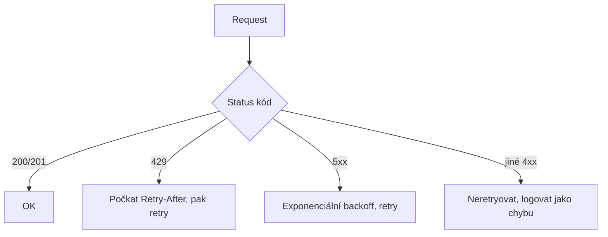

# Microsoft Graph prakticky

> Typ: povinný · Den: 3 · Odhad: 45 min výklad + 60 min Lab 4

## Cíle
- Složit vlastní Graph dotaz: endpoint, `$select`, `$filter`, `$top` — nejdřív
  v Graph Exploreru, pak ve skriptu.
- Korektně projít stránkovanou odpověď (`@odata.nextLink`) — žádná tichá ztráta dat
  po první stránce.
- Základně rozlišit chyby: co retryovat (429, 5xx) a co ne (ostatní 4xx) — a vědět, že
  `Retry-After` je závazný pokyn, ne doporučení.
- Výhled: vědět, že existuje batching, delta query a throttling limity — kam sáhnout,
  až skripty porostou.

## Výklad

### Anatomie dotazu — od Exploreru ke skriptu
Graph Explorer (`https://developer.microsoft.com/graph/graph-explorer`) je sandbox, kde
se dotaz poskládá bez jediného řádku kódu — návrat ke cvičení z D1
([`../../day-1/api-landscape/exercise-graph-explorer.md`](../../day-1/api-landscape/exercise-graph-explorer.md)),
teď se složitějšími dotazy a přenosem do skriptu. Anatomie:

```http
GET https://graph.microsoft.com/v1.0/users?$select=displayName,mail&$filter=accountEnabled eq true&$top=10
```

- **endpoint** (`/users`, `/sites`, `/me/messages`) — co chci;
- **`$select`** — jen sloupce, které potřebuji (rychlejší, čitelnější);
- **`$filter`** — podmínka na straně serveru (ne stahovat všechno a filtrovat doma);
- **`$top`** — velikost stránky.

Tentýž dotaz pak ve skriptu: `Invoke-MgGraphRequest -Uri "..."` (nebo přes
`Connect-CourseTarget` wrapper z Labu 3). Odpověď je JSON — od D1 domácí formát.

### Stránkování — první dospělý problém každého skriptu
Graph nikdy nevrací "všechno" — vrací stránku a odkaz na další v `@odata.nextLink`.
Skript, který nextLink nesleduje, **tiše** zpracuje jen první stránku a tváří se
úspěšně — nejzáludnější kategorie chyby: žádná chybová hláška, jen špatná data.
Vzor: smyčka `while ($response.'@odata.nextLink')`.

### Chyby: transientní vs permanentní
**Transientní (přechodná) chyba** vznikla dočasným stavem — stejný požadavek za chvíli
projde beze změny: throttling (429 — server vás dočasně brzdí), 5xx (chvilkový problém
na straně serveru), síťový výpadek. **Permanentní chyba** je ve vašem požadavku nebo
oprávněních — opakování nepomůže: 401/403 (chybí permission), 404 (špatné ID/URL),
400 (vadná syntax). Mnemotechnika: transientní = „zkus to za chvíli, svět se spraví
sám"; permanentní = „oprav nejdřív sebe". Proč na tom záleží: retry permanentní chyby
jen maskuje skutečný problém (403 čekáním nezmizí) — a pád na prvním 429 je zbytečná
křehkost, throttling je v M365 normální provozní stav, ne porucha.

Prakticky: chybový objekt Graphu má strojově čitelné `code` — vázat logiku na něj, ne
na text `message`. Pravidlo: **429** → počkat přesně `Retry-After` sekund (závazné,
ne orientační — předčasný retry throttling prodlužuje) a zkusit znovu; **5xx** → retry
s rostoucím čekáním; **ostatní 4xx** → neretryovat (fail-fast), to je chyba k vyřešení,
ne k opakování. Graph SDK mají retry vestavěný — vlastní smyčku psát jen tam, kde SDK
nepomáhá.



### Výhled — až skripty porostou
- **JSON batching** (`POST /$batch`): až 20 requestů v jednom volání; pozor, batch-level
  200 neznamená úspěch všech dílčích odpovědí.
- **Delta query**: "co se změnilo od minula" místo plného re-scanu.
- **Throttling limity** se liší po workloadu a mění se v čase.

V tomto kurzu jen orientačně — plná hloubka je v mateřském kurzu GOC223.

## Klíčové rozlišení
- **`$filter` na serveru vs filtrování v pipeline doma** — server vrátí méně dat rychleji;
  `Where-Object` až jako poslední možnost.
- **Jedna stránka vs kompletní dataset** — bez průchodu `@odata.nextLink` skript lže.
- **Transientní (429/5xx → retry) vs permanentní (jiné 4xx → fail-fast)** — opakovat
  má smysl jen u chyb, které odezní samy; permanentní chybu retry jen maskuje.
- **`code` (stabilní) vs `message` (může se změnit)** v chybovém objektu.

## Lab
Viz [`lab-graph-ingest.md`](lab-graph-ingest.md).

## Tipy
- **Živá dema přístupu k datům**: [`demo-live-data.md`](demo-live-data.md) — zásobník
  spustitelných vzorů (uživatelé, weby, položky seznamu, soubory, search, členství
  skupin, report do CSV, dávkový zápis), vždy Graph i PnP vedle sebe a s pointou
  „co si všimnout". Odtud berte vzory pro Lab 5 i pro prompty Copilotu.
- **Tahák SPO API**: [`tips-spo-api.md`](tips-spo-api.md) — jak zjistit ID webu/site/seznamu,
  definici seznamu a knihovny, **interní názvy polí** a povolené hodnoty choice polí
  (Graph / PnP / REST vedle sebe). Budete ho potřebovat v Labu 5 i v praxi.
- `Retry-After` čtěte vždy z odpovědi — pevný `Start-Sleep -Seconds 30` je anti-pattern
  (a v ověření labu neprojde).
- OData `$filter` má vlastní syntax (`eq`, jednoduché uvozovky, case-sensitive) —
  skládejte dotaz v Graph Exploreru, kde chybu vrátí hned; do skriptu přenášejte ověřený.
- Počet výsledků skriptu vždy porovnejte s Graph Explorerem — skript bez `nextLink`
  smyčky selže tiše: vrátí méně dat bez jediné chybové hlášky.

## Zdroje (Microsoft)
- [Graph Explorer](https://developer.microsoft.com/en-us/graph/graph-explorer)
- [Use query parameters to customize responses](https://learn.microsoft.com/en-us/graph/query-parameters)
- [Paging Microsoft Graph data in your app](https://learn.microsoft.com/en-us/graph/paging)
- [Microsoft Graph throttling guidance](https://learn.microsoft.com/en-us/graph/throttling)
- [Microsoft Graph error responses and resource types](https://learn.microsoft.com/en-us/graph/errors)

## Stav produktu / delta
- Ověřit k datu běhu — service-specific throttling limity (počet requestů/sec per aplikace/tenant)
  se liší po workloadu a mění se; ověřit aktuální hodnoty na [Microsoft Graph service-specific throttling limits](https://learn.microsoft.com/en-us/graph/throttling-limits) před demonstrací.
